# otel-fleet

[](https://github.com/sag-solutions/otel-fleet/actions/workflows/ci.yaml)
[](LICENSE)
[](https://sag-solutions.github.io/otel-fleet/)

**Self-hosted, multi-tenant OpenTelemetry collector fleet management.** Receive
logs, traces and metrics from multiple customers via OTLP, attribute every
datapoint to a tenant, store it in ClickHouse and/or forward it to each
customer's own backends — managed through a web UI.

> **Status: 1.0 — production-ready.** From v1.0.0 the REST API (`/api/v1`), the
> `OTEL_FLEET_` environment surface, and the Helm chart values follow
> [Semantic Versioning](https://sag-solutions.github.io/otel-fleet/operations/stability/).
> Runs HA (stateless API tier + leader-elected OpAMP tier), TLS/mTLS on every
> listener, per-tenant isolation and quotas, and ships cosign-signed images with
> SBOM + SLSA provenance. See the
> [security model](https://sag-solutions.github.io/otel-fleet/operations/security-model/)
> and [sizing guide](https://sag-solutions.github.io/otel-fleet/operations/sizing/).

## Features

- **Multi-tenant ingest** — per-customer API keys (show-once secrets); the
  gateway collector validates every OTLP request against the control plane and
  stamps `tenant.id` on every resource, overwriting anything the client sent.
  Key revocation reaches the gateways within the 30s auth cache.
- **Pipelines from the UI** — versioned processor/exporter graphs built with
  schema-driven forms, validated with the **real collector binary**
  (`otelcol validate`) before rollout, one-click rollback.
- **Two-tier gateway** — a static ingest tier that must never break, and a
  control-plane-rendered forwarding tier routing per signal by `tenant.id` to
  customer backends.
- **Edge agents via OpAMP** — collectors at customer sites (OpAMP supervisor +
  the same distro) dial out, enroll with show-once bootstrap tokens, receive
  full configs remotely, and revert locally if a pushed config crash-loops.
- **Accurate throughput metrics** — ground-truth ingest counters per tenant plus
  per-pipeline-stage sent/failed/queued from collector self-telemetry.
- **Enterprise auth** — SSO (Google, Microsoft Entra ID, GitHub, generic OIDC) +
  **SAML**; roles admin/operator/viewer with per-customer tenant scoping;
  **SCIM 2.0** provisioning, including **group → role/tenant mapping**; user
  invites; queryable audit log. Secrets AES-256-GCM-encrypted at rest with
  zero-downtime key rotation.
- **Self-service tenant portal** — scoped customer users get a purpose-built
  portal (their usage, API keys, agent enrollment, pipelines) — never the
  fleet-wide admin console.
- **Multi-region / data residency** — pin a customer to a region; its telemetry
  is written, read, retained, and alerted on only in that region's stores.
  Fleet-wide views fan out and merge. Deleting a customer purges its telemetry
  (right-to-erasure).
- **Native alerting** — metric-threshold and PromQL rules (per region), firing
  to Slack / PagerDuty / Opsgenie / signed webhooks, with severities and
  maintenance windows — no Alertmanager.
- **Metered billing** — priced monthly statements per customer with
  per-customer price overrides and CSV export.
- **Kubernetes monitoring** — an OpenTelemetry-native replacement for the
  kube-prometheus-stack (cluster/node/pod metrics → VictoriaMetrics, Target
  Allocator, recording rules, curated Grafana dashboards).
- **Runs in production** — HA control plane, KEDA autoscaling, backup/restore,
  NetworkPolicies, rate limiting, a control-plane health dashboard, and
  cosign-signed images with SBOM + SLSA provenance.

## Screenshots

|  |  |
|---|---|
| **Dashboard** — fleet-wide ingest and top customers by volume | **Pipeline builder** — schema-driven form with a live, validated YAML preview |
| [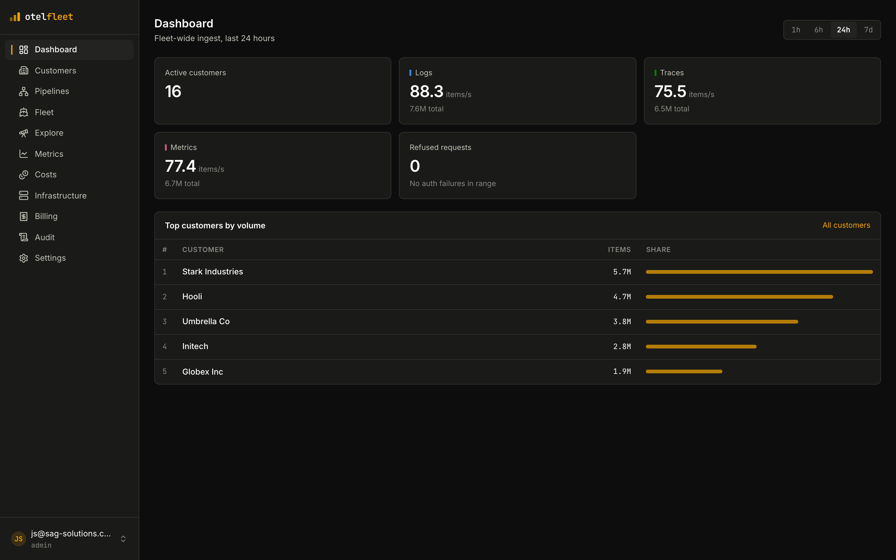](docs/public/assets/screenshots/dashboard.png) | [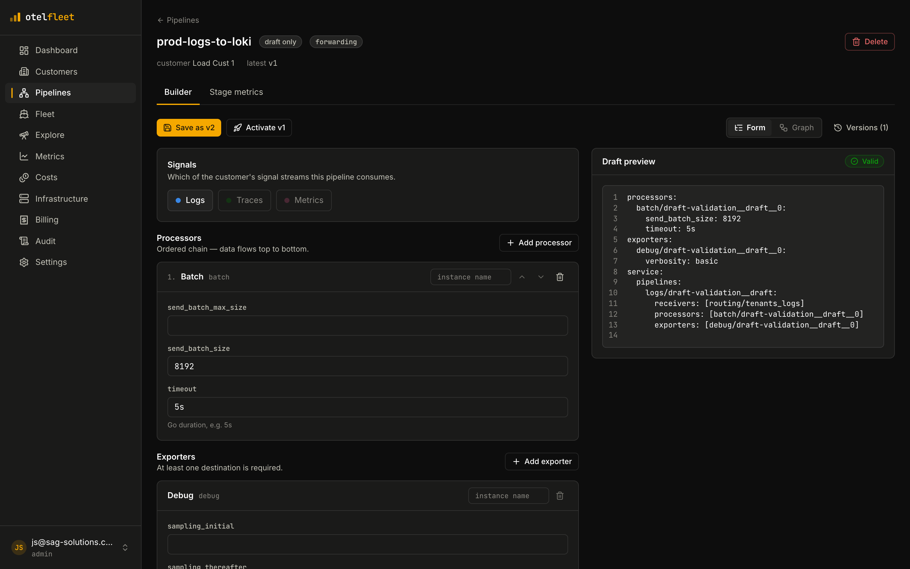](docs/public/assets/screenshots/pipeline-builder.png) |
| **Explore** — search a tenant's stored logs on the read path | **Explore** — root-span trace list with span and error counts |
| [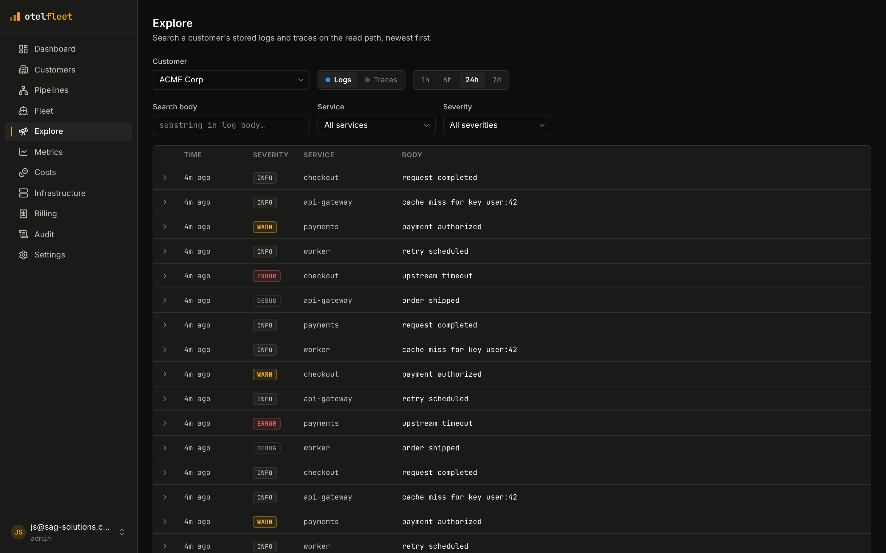](docs/public/assets/screenshots/explore-logs.png) | [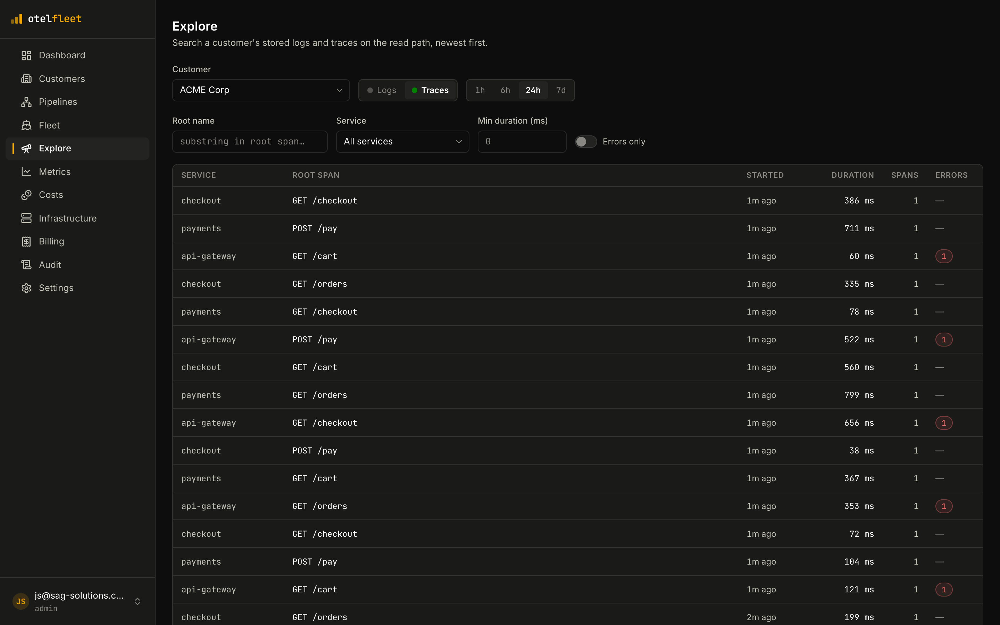](docs/public/assets/screenshots/explore-traces.png) |
| **Fleet** — every collector managed over OpAMP, with config sync status | **Billing** — metered statements with per-customer price overrides |
| [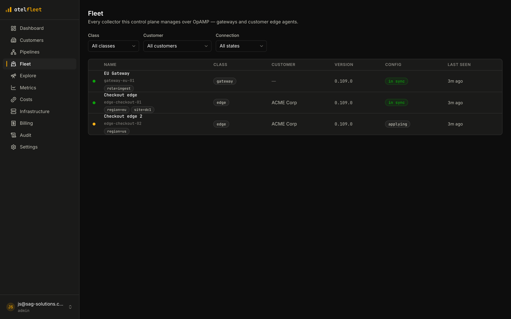](docs/public/assets/screenshots/fleet.png) | [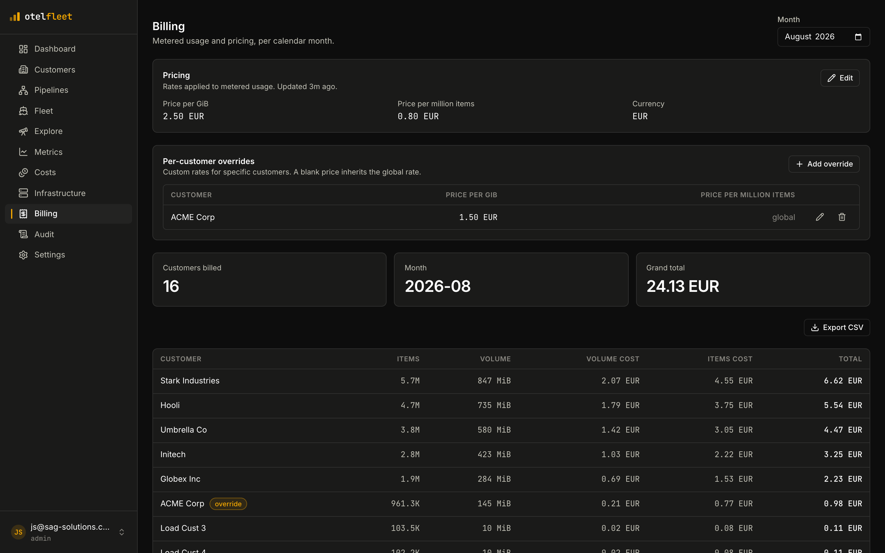](docs/public/assets/screenshots/billing.png) |
| **Tenant portal** — scoped self-service view for a customer's own users | **Alerting** — metric-threshold + PromQL rules with severities and channels |
| [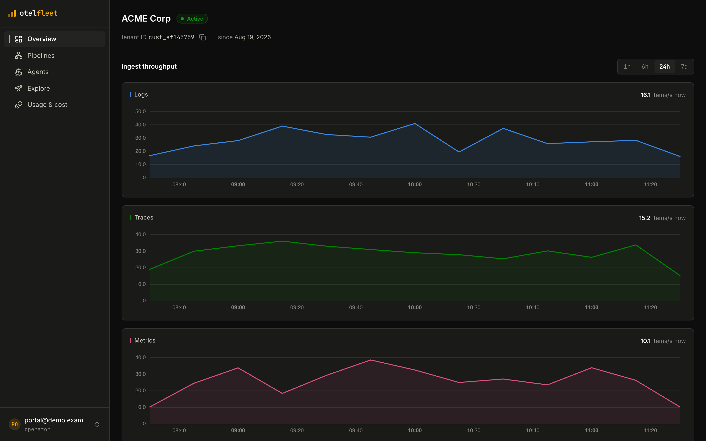](docs/public/assets/screenshots/portal.png) | [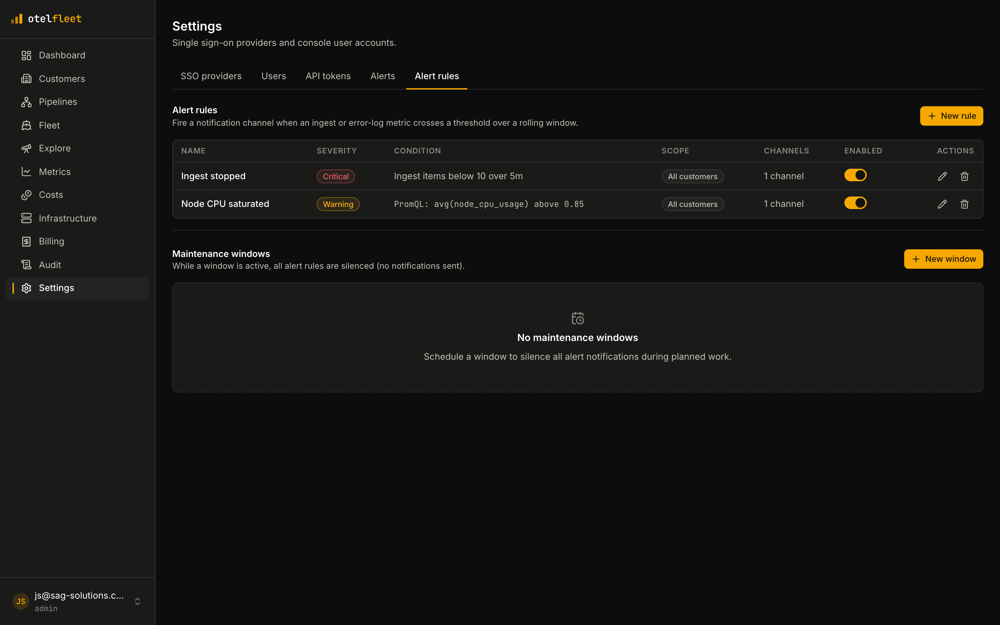](docs/public/assets/screenshots/alert-rules.png) |
| **Metrics** — per-tenant PromQL over VictoriaMetrics, scoped to the customer | **Pipeline graph** — the same pipeline as a visual receiver→processor→exporter DAG |
| [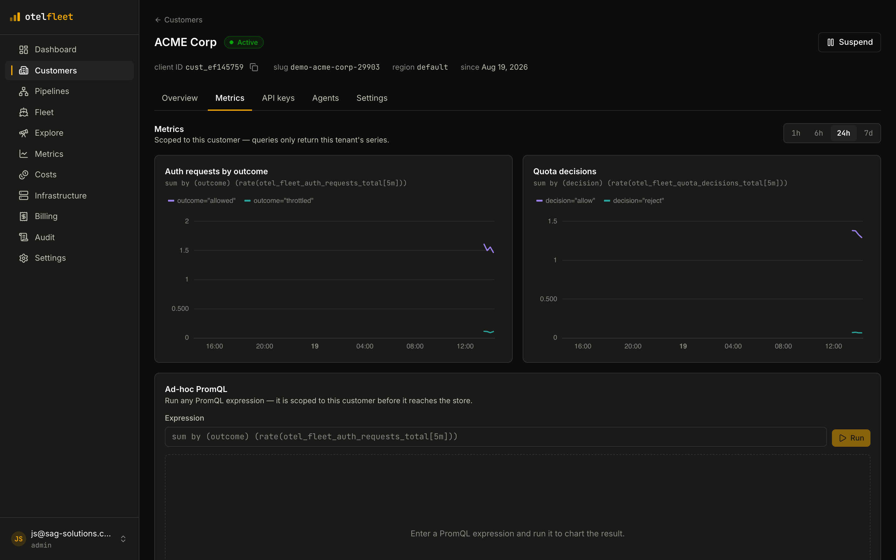](docs/public/assets/screenshots/metrics-explorer.png) | [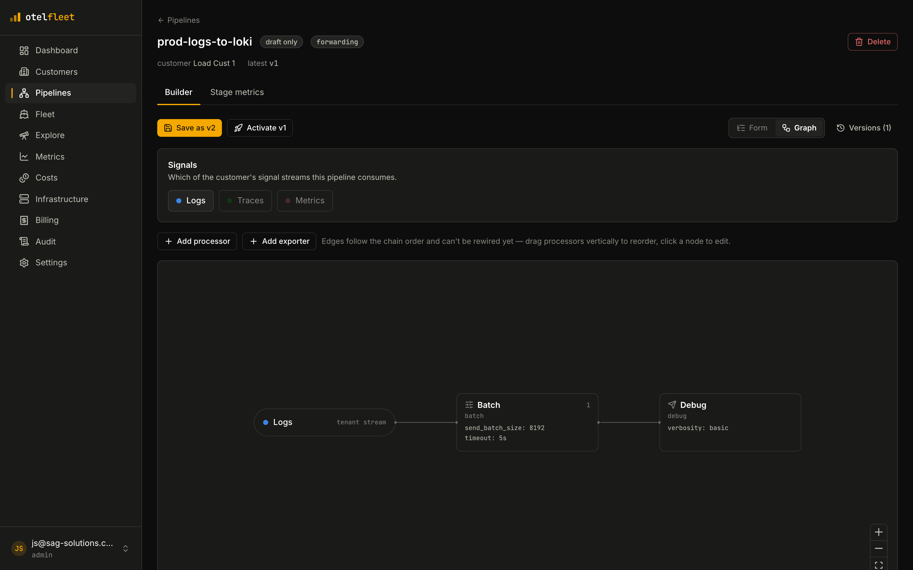](docs/public/assets/screenshots/pipeline-graph.png) |

## Architecture

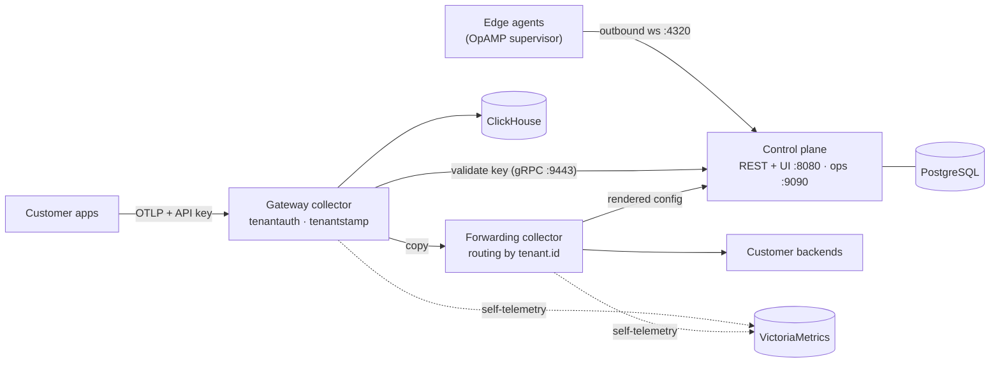

One Go binary serves the REST API + embedded React SPA, the internal gRPC
API-key service, an ops listener (metrics + rendered collector configs) and the
OpAMP server. The collectors are a custom OCB distribution with two local
components, `tenantauth` and `tenantstamp`. Full story:
[architecture docs](https://sag-solutions.github.io/otel-fleet/architecture/).

## Quickstart

**Demo (everything in containers):**

```sh
docker compose -f deploy/compose/docker-compose.demo.yaml up -d --build
open http://localhost:8080    # dev login as admin@example.com (admin); any other email = read-only viewer
```

Create a customer + API key in the UI (shown once!), then generate traffic:

```sh
OTEL_FLEET_API_KEY=otm_... docker compose \
  -f deploy/compose/docker-compose.demo.yaml --profile loadgen up loadgen
```

**Kubernetes (Helm, bring your own PostgreSQL/ClickHouse/VictoriaMetrics):**

```sh
helm install otel-fleet oci://ghcr.io/sag-solutions/charts/otel-fleet \
  --version 1.0.0 --namespace otel-fleet --create-namespace --values my-values.yaml
```

**Hacking on otel-fleet** (Go 1.26+, Node 24+ with pnpm, Docker):

```sh
make dev-up
OTEL_FLEET_DEV_LOGIN=true OTEL_FLEET_MASTER_KEY=$(openssl rand -base64 32) make run
cd web && pnpm install && pnpm dev
```

Full walkthroughs: [quickstart](https://sag-solutions.github.io/otel-fleet/quickstart/) ·
[Helm install](https://sag-solutions.github.io/otel-fleet/installation/helm/) ·
[configuration reference](https://sag-solutions.github.io/otel-fleet/installation/configuration/).

## Repository layout

```
api/openapi.yaml     REST contract (source of truth for Go + TS codegen)
cmd/otel-fleet        control-plane binary
internal/            backend packages
proto/               internal gRPC contract (API-key validation)
collector/           custom collector distro (OCB manifest + tenantauth/tenantstamp)
web/                 React SPA
deploy/              compose dev+demo envs, Helm chart, ClickHouse DDL
docs/                documentation site (Astro Starlight)
```

## Community

- **Contributing:** [CONTRIBUTING.md](CONTRIBUTING.md) — dev setup,
  conventional commits, DCO, the codegen-drift rule.
- **Bugs & ideas:** [GitHub issues](https://github.com/sag-solutions/otel-fleet/issues)
  (templates provided).
- **Security:** privately to security@sag-solutions.com — see
  [SECURITY.md](SECURITY.md).
- **Code of conduct:** [Contributor Covenant 2.1](CODE_OF_CONDUCT.md).
- **Releases:** tagged `v*`, images + charts on GHCR, cosign-signed with SBOM +
  SLSA provenance ([verifying artifacts](https://sag-solutions.github.io/otel-fleet/installation/helm/#verifying-artifacts)) — see
  [RELEASING.md](RELEASING.md).

## License

[Apache-2.0](LICENSE)
