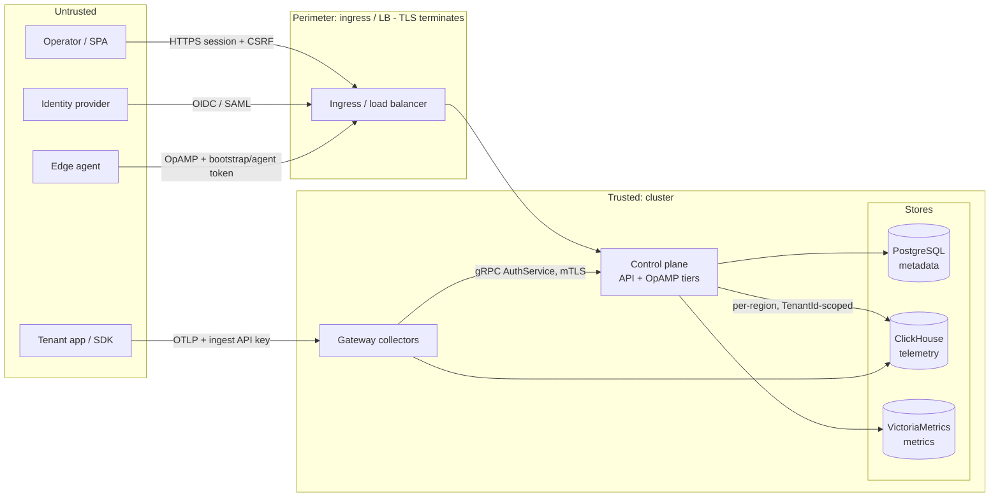

This page describes otel-fleet's security posture: the trust boundaries, the
controls at each, what the operator must configure, and the residual risks we
accept and why. It is a consolidation of controls that exist in the code — not
aspirational.

## Components & trust boundaries

The **control plane holds only metadata** (customers, users, pipelines, keys,
audit) in PostgreSQL — never tenant telemetry. Telemetry lives in ClickHouse
(and metrics in VictoriaMetrics), written by gateways and read back only through
tenant-scoped queries.

## Controls by boundary

### Human authentication
- **SSO/OIDC** with PKCE (S256), state bound to the session, ID-token
  verification, and `email_verified` enforced. **SAML** assertions are
  signature-verified against the configured IdP certificate, with audience and
  validity-window checks.
- **Sessions** are server-side (PostgreSQL-backed), cookie `HttpOnly`,
  `SameSite=Lax`, `Secure` + `__Host-` prefix when `OTEL_FLEET_SESSION_SECURE=true`,
  24 h lifetime, token **renewed on login** (session-fixation defense).
- **CSRF**: a per-session token, constant-time compared, required (`X-CSRF-Token`)
  on every mutating request. API-token clients are exempt (not cookie-based).
- `dev-login` (email-only) is off unless `OTEL_FLEET_DEV_LOGIN=true` — never
  enable it in production.

### Machine / agent authentication
- **Management-API tokens** (`otm_pat_`), **ingest API keys** (`otm_`), and
  OpAMP **bootstrap** (`otm_bt_`) / **per-agent** (`otm_at_`) tokens are all
  256-bit random secrets; only a **SHA-256 hash** is stored, looked up by a clear
  prefix and compared constant-time. (Unsalted SHA-256 is appropriate here — these
  are high-entropy secrets, not user passwords; otel-fleet stores no passwords.)
- Gateways authenticate tenants by calling the control-plane gRPC
  **AuthService**, with a 30 s cache. An edge agent's per-agent token authorizes
  **only its own** agent; a bootstrap token is exchanged for a per-agent token on
  first connect and is expiry/uses-limited.

### Authorization & tenant isolation
- Roles **viewer < operator < admin**; mutations require operator+. Admin-only
  areas (users, SSO settings, API tokens, billing, audit, alert rules) are
  gated for **all** methods.
- **Tenant-scoped RBAC**: non-admins can be restricted to specific customers via
  grants; every scoped endpoint and aggregate enforces the scope (403 on a
  foreign tenant, audited as a denial).
- **Read isolation**: every telemetry query is bound to the caller's
  `TenantId` — a customer can only read its own data.
- **Ingest isolation**: the `tenantstamp` processor **strips any client-supplied
  tenant attributes and stamps the authenticated tenant**, so a tenant cannot
  spoof another; unauthenticated batches are dropped.

### Transport security
- `internal/tlsconf` provides TLS (1.2 floor) and mutual-TLS. The internal gRPC
  **AuthService supports mTLS** (`OTEL_FLEET_GRPC_CLIENT_CA_FILE`); the OpAMP
  listener supports client-cert mTLS (`OTEL_FLEET_OPAMP_CLIENT_CA_FILE`); gateway
  OTLP ingest TLS/mTLS is opt-in in the chart.
- **Listeners are plaintext by default** — the intended pattern is TLS
  termination at a trusted ingress/LB. Serving TLS directly is opt-in via cert
  env/secrets. See *Deployment responsibilities* below.

### Secrets at rest
- Auth-provider secrets, webhook secrets, and pipeline password fields are
  encrypted with **AES-256-GCM** (versioned nonce) under `OTEL_FLEET_MASTER_KEY`;
  the store never sees plaintext. Secrets are **redacted** on the way to the UI
  (a sentinel round-trips "keep existing").
- **Zero-downtime key rotation**: encrypt with the primary key, decrypt against
  primary + `OTEL_FLEET_MASTER_KEY_SECONDARY`, then re-encrypt
  (Settings → SSO → Encryption at rest).

### Network & workload (Kubernetes)
- Opt-in **NetworkPolicies** for the control plane (public vs internal ports)
  and a default **deny-all** ingress for edge agents unless allow-listed.
- Pods run **nonroot** (uid 65532), `allowPrivilegeEscalation: false`,
  `capabilities: drop [ALL]`, `seccompProfile: RuntimeDefault`; images are
  **distroless nonroot**. `loadBalancerSourceRanges` restrict public listeners.

### Abuse / DoS / input
- Per-client-IP **rate limiting** (stricter on `/auth/*`), a **request-body cap**
  (4 MiB), and HTTP server read/write/idle timeouts. Every denial (401/403/429)
  is logged and counted (`otel_fleet_http_denied_total{reason}`) — never written
  to the DB, so floods can't grow state.
- Per-tenant **ingest quota** (`tenantquota`) rejects over-budget batches with a
  retryable `RESOURCE_EXHAUSTED` (→ 429), isolating a noisy tenant.

### Data handling
- **Data residency**: a customer is pinned to a region; its telemetry is written,
  read, and retained only in that region's ClickHouse/VM. Fleet-wide aggregates
  fan out and merge; the sole region-unaware surface is the admin ad-hoc PromQL
  panel (a manual query has no region context).
- **Right-to-erasure**: deleting a customer purges its telemetry from ClickHouse
  (`OTEL_FLEET_PURGE_ON_DELETE`, default on); otherwise data expires via TTL.
- **Audit log** entries are written in the same transaction as the mutation they
  record and are readable only by admins.

### Supply chain
- Release images are **cosign-signed** (keyless) and carry a **SBOM** + max-mode
  **SLSA build provenance**; archives ship SPDX SBOMs. See
  [Verifying artifacts](/installation/helm/#verifying-artifacts).

## Deployment responsibilities

otel-fleet ships secure-capable but not secure-by-accident. For production:

1. **Terminate TLS** at an ingress/LB, or enable the control-plane and ingest
   TLS options — do not expose plaintext listeners to untrusted networks.
2. Set **`OTEL_FLEET_SESSION_SECURE=true`** (enables `Secure` + `__Host-` cookie).
3. Set **`OTEL_FLEET_MASTER_KEY`** (32 random bytes) so SSO providers and
   pipeline secrets are stored encrypted; rotate it periodically.
4. **Front a global rate limit** at the ingress — the in-app limiter is
   per-replica (defense-in-depth, not a cluster-wide quota).
5. Keep **`OTEL_FLEET_DEV_LOGIN`** unset/false.
6. Apply **NetworkPolicies** and `loadBalancerSourceRanges`; enable **mTLS** on
   the gRPC AuthService and OpAMP where the network is not already trusted.
7. Be deliberate with **tenant grants**: a non-SCIM, non-admin user with *no*
   grants sees *all* customers (backward-compatible default). Use explicit grants
   or SCIM-group management to scope users.
8. Route audit logs and denial metrics to your SIEM; wire the
   [recommended alerts](/operations/runbooks/#recommended-control-plane-alerts).

## Residual risks (accepted, with rationale)

| Risk | Rationale / mitigation |
| --- | --- |
| **Ingest fail-open**: if the control plane is unreachable, the gateway admits recently-valid API keys within a `stale_if_error` window | Availability over strictness for telemetry ingest; bounded window, keys must have been valid recently. |
| **Rate limiter is per-replica** | No shared Redis/DB dependency; front with an ingress limiter for a global cap. |
| **SAML**: unsigned AuthnRequests, unencrypted assertions accepted | Assertion **signatures are verified**; confidentiality relies on TLS. The SP holds no key pair by design. |
| **Microsoft OIDC** issuer check relaxed for multi-tenant | Compensated by validating the issuer against a Microsoft-tenant regex after exchange. |
| **No-grants = all-customers** for non-SCIM users | Backward compatibility; call out in onboarding and prefer explicit grants / SCIM. |
| **Plaintext listeners by default** | Intended to sit behind a TLS-terminating ingress; all TLS/mTLS options exist and are documented. |
| **Master key optional** | If unset, secret-bearing features are disabled (not silently insecure); set it in production. |

## Reporting a vulnerability

Report suspected vulnerabilities **privately** to **security@sag-solutions.com**
(acknowledged within 3 business days; 90-day coordinated disclosure). Do not open
public issues for security problems. See `SECURITY.md` for the full policy and
supported-versions statement.
